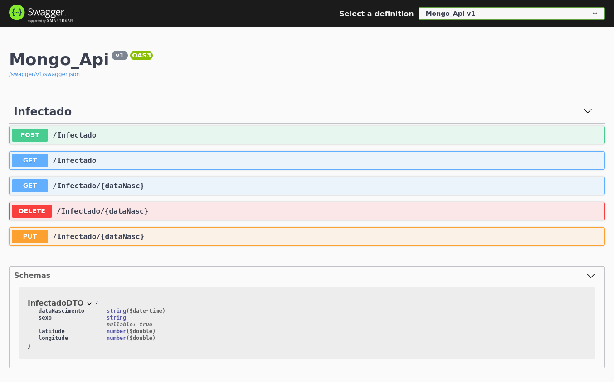

<div align="center" id="top">
  

  &#xa0;

</div>

<h1 align="center">Mongo Api</h1>

<p align="center">
  

  

  

  <!--  -->

  <!--  -->

  <!--  -->
</p>

<!-- Status -->

<!-- <h4 align="center"> 
	🚧  Mongo Api 🚀 Under construction...  🚧
</h4> 

<hr> -->

<p align="center">
  <a href="#dart-about">About</a> &#xa0; | &#xa0; 
  <a href="#rocket-technologies">Technologies</a> &#xa0; | &#xa0;
  <a href="#white_check_mark-requirements">Requirements</a> &#xa0; | &#xa0;
  <a href="#checkered_flag-starting">Starting</a> &#xa0; | &#xa0;
  <a href="https://github.com/leodev0" target="_blank">Author</a>
</p>

<br>

## :dart: About ##

API to manage covid-19 infected pacients and keep track of them. After succesfully starting the server you can read the documentation on https://localhost:5001/swagger


## :rocket: Technologies ##

The following tools were used in this project:

- .NET Core
- C#

## :white_check_mark: Requirements ##

Before starting :checkered_flag:, you need to have [Git](https://git-scm.com) and .NET Core installed.

## :checkered_flag: Starting ##

```bash
# Clone this project
$ git clone https://github.com/leodev0/mongo-api

# Access
$ cd mongo-api

# Add the MongoDB connection string at 
$ mongo-api/appsettings.json

# Compile and run the project
$ dotnet run

# The server will initialize and you can read the documentation on <https://localhost:5001/swagger>
```

&#xa0;

<a href="#top">Back to top</a>
